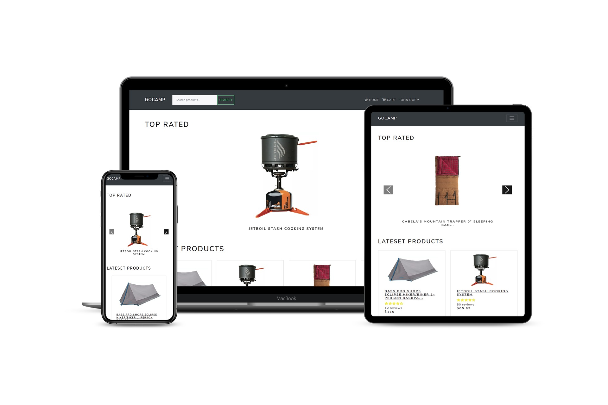

# gocamp

> eCommerce platform for camping products, built with the MERN stack & Redux.

Live demo:
https://app-gocamp.herokuapp.com/ 



## Features

- Full featured shopping cart
- Product reviews and ratings
- Top products carousel
- Product pagination
- Product search feature
- User profile with orders
- Admin product management
- Admin user management
- Admin Order details page
- Mark orders as delivered option
- Checkout process (shipping, payment method, etc)
- PayPal / credit card integration
- Database seeder (products & users)

 ## Sample Users To Login
email |password
------------ | -------------
admin@example.com | 123456
john@example.com | 123456
jane@example.com | 123456

 ## Paypal credentials
email | password
------------ | -------------
sb-jdoe@personal.example.com | [,?w)S8g

## Installation & Usage


### Env Variables
create .env file in the root directory

```sh
NODE_ENV = development
PORT = 5000
MONGO_URI = your mongodb uri
JWT_SECRET = your jwt string
PAYPAL_CLIENT_ID = your paypal client id

```

### Install Dependencies (frontend & backend)

```sh

npm install
cd frontend
npm install

```

### Run (npm scripts)

```sh
# Run frontend (:3000) & backend (:5000)
npm run dev

# Run backend only
npm run server

# Run frontend only
npm run client

```
### Seed Database

You can use the following commands to seed the database with some sample users and products as well as destroy all data

```sh

# Import data
npm run data:import

# Destroy data
npm run data:destroy

```

### Postman file for testing
Open postman and import the file from backend/goCamp.postman_collection.json 


